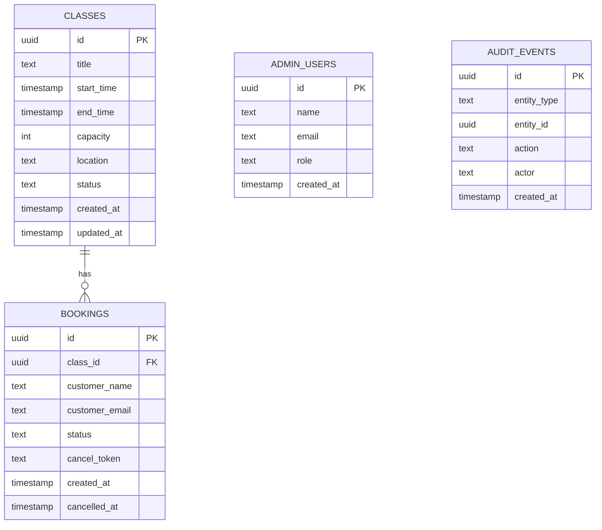

# Daphstar Fitness App - Full Spec

## 1) Summary
A booking system for Daphstar Fitness that lets customers view a published class schedule, book a spot, and cancel. The owner can create and manage classes, capacity, and attendance. The first release targets a mobile-friendly web app with email confirmations.

## 2) Goals and Non-Goals
### Goals
- Simple booking and cancellation flow from a phone.
- Owner-managed class schedule and capacity.
- Clear confirmations and policy communication.
- Fast, low-cost launch.

### Non-Goals (Initial)
- Payments and memberships.
- Waitlists and dynamic pricing.
- Multi-location support.
- SMS notifications.
- Instructor management.

## 3) Personas
- Customer: books classes on a phone, expects fast confirmation and easy cancel.
- Owner/Admin: publishes schedule, manages capacity, needs attendee visibility.

## 4) User Stories
### Customer
- As a customer, I can see upcoming classes with spots left.
- As a customer, I can book a class in less than a minute.
- As a customer, I can cancel a booking within the allowed window.
- As a customer, I receive an email confirmation for booking and cancellation.

### Admin
- As an admin, I can create and edit classes on a calendar.
- As an admin, I can set class capacity and see remaining spots.
- As an admin, I can view the attendee list for any class.
- As an admin, I can cancel a class and notify attendees.

## 5) Core Flows
### Customer Booking Flow
1. Open schedule.
2. Select a class.
3. Enter name and email (and optional phone if needed later).
4. Confirm booking.
5. Receive confirmation email.

### Customer Cancellation Flow
1. Open confirmation email or booking list (if accounts exist later).
2. Confirm cancellation.
3. Receive cancellation email.

### Admin Class Management Flow
1. Open admin dashboard.
2. Create/edit class details (type, time, capacity).
3. Publish schedule updates.
4. View attendee list.
5. Cancel class and notify attendees.

## 6) Screens and Views
### Public
- Schedule list (default view) with class cards.
- Class detail (optional if schedule cards are sufficient).
- Booking confirmation page.
- Cancellation confirmation page.

### Admin
- Login (simple password or magic link).
- Schedule management (calendar or list).
- Class edit/create modal or page.
- Attendee list view.
- Class cancellation dialog.

## 7) Data Model (MVP)
### Class
- id
- title
- start_time
- end_time
- capacity
- location (optional)
- status (scheduled, cancelled)
- created_at
- updated_at

### Booking
- id
- class_id
- customer_name
- customer_email
- status (active, cancelled)
- created_at
- cancelled_at

### AdminUser
- id
- name
- email
- role (owner)
- created_at

## 8) Business Rules
- Capacity must not be exceeded.
- Cancellation allowed until a defined cutoff (open question).
- If a class is cancelled, all active bookings are cancelled and notified.
- Email address is required for confirmations.

## 9) Notifications
- Booking confirmation email.
- Cancellation confirmation email.
- Class cancellation email to all attendees.

## 10) Permissions
- Public users can view schedule and create/cancel their booking.
- Admin users can create/edit/cancel classes and view attendees.

## 11) Non-Functional Requirements
- Mobile-first responsive layout.
- Page loads under 2 seconds on standard mobile data.
- Basic accessibility: readable contrast, tap targets, clear focus.
- Auditability: store booking and cancellation timestamps.

## 12) Analytics (Simple)
- Total bookings per week.
- Cancellations per week.
- Average occupancy per class.

## 13) Open Questions
- What is the cancellation window and no-show policy?
- Should customers create accounts or use one-time booking links?
- Do you want public visibility of class capacity?
- Do you want a public landing page and marketing info?

## 14) Risks and Mitigations
- No-shows remain high: add reminder emails later.
- Owner workload too high: add recurring classes and bulk edits.
- Demand exceeds capacity: add waitlist later.

## 15) Acceptance Criteria (MVP)
- Customer can book and cancel with email confirmations.
- Admin can create/edit/cancel classes and see attendees.
- Capacity is enforced.
- Class cancellation notifies all attendees.

## 16) Rollout Plan
- Private beta with a small client group.
- Adjust policies and UI based on feedback.
- Public launch.

## 17) Wireframe Outline (MVP)
### Public Schedule
- Header with brand and short tagline.
- Date selector (today + next 7 days).
- Class cards: title, time, spots left, book button.
- Policy snippet: cancellation window and no-show policy.

### Class Detail (Optional)
- Class summary with time, duration, capacity.
- Book form: name, email.
- Primary action: confirm booking.
- Secondary action: back to schedule.

### Booking Confirmation
- Success message and class summary.
- Cancellation link (tokenized).
- Calendar add links (optional later).

### Cancellation Confirmation
- Status message and class summary.
- CTA to return to schedule.

### Admin Login
- Email + magic link or password.
- Simple error state and retry.

### Admin Schedule Management
- Calendar or list view toggle.
- Create class button.
- Class rows with edit, cancel, attendees.

### Admin Class Editor
- Fields: title, date, start/end time, capacity, status.
- Save and cancel buttons.

### Admin Attendees
- Attendee list with name, email, booking time.
- Export CSV button (optional later).

### Admin Cancel Class
- Confirm cancel dialog.
- Warn that attendees will be notified.

## 18) Database Schema and API Endpoints
### Schema (Relational)
#### classes
- id (uuid, pk)
- title (text)
- start_time (timestamp)
- end_time (timestamp)
- capacity (int)
- location (text, nullable)
- status (text: scheduled, cancelled)
- created_at (timestamp)
- updated_at (timestamp)

#### bookings
- id (uuid, pk)
- class_id (uuid, fk -> classes.id)
- customer_name (text)
- customer_email (text)
- status (text: active, cancelled)
- cancel_token (text, unique)
- created_at (timestamp)
- cancelled_at (timestamp, nullable)

#### admin_users
- id (uuid, pk)
- name (text)
- email (text, unique)
- role (text: owner)
- created_at (timestamp)

#### audit_events (optional MVP)
- id (uuid, pk)
- entity_type (text)
- entity_id (uuid)
- action (text)
- actor (text: admin or customer)
- created_at (timestamp)

### API Endpoints (REST)
#### Public
- GET /api/classes?from=YYYY-MM-DD&to=YYYY-MM-DD
	- Returns scheduled classes and remaining capacity.
- GET /api/classes/{id}
	- Returns class details and availability.
- POST /api/bookings
	- Body: class_id, customer_name, customer_email
	- Creates booking if capacity allows, returns booking + cancel_token.
- POST /api/bookings/cancel
	- Body: cancel_token
	- Cancels booking if within allowed window.

#### Admin
- POST /api/admin/login
	- Magic link or session creation.
- GET /api/admin/classes?from=YYYY-MM-DD&to=YYYY-MM-DD
	- Admin schedule view including cancelled classes.
- POST /api/admin/classes
	- Create class.
- PUT /api/admin/classes/{id}
	- Update class.
- POST /api/admin/classes/{id}/cancel
	- Cancel class and notify attendees.
- GET /api/admin/classes/{id}/attendees
	- List active bookings for a class.

### Notes
- Remaining capacity is computed as capacity minus active bookings.
- Use a unique cancel token to allow cancellation without accounts.
- Consider rate limits on booking and cancellation endpoints.

## 19) API Contract Examples
### GET /api/classes?from=2026-02-07&to=2026-02-14
Response 200
```json
{
	"classes": [
		{
			"id": "cls_123",
			"title": "Strength Fundamentals",
			"start_time": "2026-02-08T18:00:00-05:00",
			"end_time": "2026-02-08T19:00:00-05:00",
			"capacity": 12,
			"spots_left": 4,
			"status": "scheduled"
		}
	]
}
```

## 20) Data Model Diagram (Mermaid)


## 21) Authentication and Authorization
### Admin Access
- Use magic-link email login for the owner account.
- Sessions stored in a secure, http-only cookie.
- Admin routes require a valid session and owner role.

### Customer Access
- No account required for MVP.
- Booking cancellation uses a unique `cancel_token` sent by email.
- Rate limit public booking and cancellation endpoints to deter abuse.

### Security Notes
- Validate input server-side for all booking and admin endpoints.
- Do not expose attendee emails in public endpoints.
- Store minimal PII and add a data retention policy later.

## 22) Implementation Plan (MVP)
### Milestone 1: Foundations
- Confirm policies: cancellation window, no-show rules.
- Finalize schedule format and class data fields.
- Choose backend and email provider.

### Milestone 2: Core Booking
- Public schedule view (mobile-first).
- Booking endpoint with capacity enforcement.
- Booking confirmation email.

### Milestone 3: Cancellation
- Tokenized cancel link flow.
- Cancellation endpoint and email.
- Policy messaging in UI.

### Milestone 4: Admin Tools
- Admin login (magic link).
- Class create/edit/cancel.
- Attendee list view.

### Milestone 5: Polish and Launch
- Basic analytics and logging.
- Accessibility and responsiveness pass.
- Private beta and fixes.
- Public launch.

## 23) Tech Stack Options
### Option A: Fastest Web MVP (Recommended)
- Frontend: Next.js or Vite + React.
- Backend: Supabase (Postgres + Auth + Edge Functions).
- Email: Resend or Postmark.
- Hosting: Vercel (frontend) + Supabase.

### Option B: Firebase First
- Frontend: React.
- Backend: Firebase (Firestore + Functions + Auth).
- Email: SendGrid.
- Hosting: Firebase Hosting.

### Option C: Cross-Platform App
- App: Flutter.
- Backend: Supabase or Firebase.
- Hosting: App stores (later) + web for admin.

### Notes
- Option A gets a mobile-friendly web app live fastest.
- Option C is best if a native app is required immediately.

## 24) Project Timeline Estimate
Assuming a small MVP with one developer and rapid feedback loops.

### Phase 1: Foundations (3-5 days)
- Confirm policies and requirements.
- Set up repo, hosting, and email provider.
- Define data schema and APIs.

### Phase 2: Booking Flow (5-8 days)
- Schedule view UI.
- Booking endpoint and capacity enforcement.
- Confirmation emails.

### Phase 3: Cancellation Flow (3-5 days)
- Cancel link flow and endpoint.
- Policy messaging in UI.
- Cancellation email.

### Phase 4: Admin Tools (6-10 days)
- Admin login.
- Class create/edit/cancel.
- Attendee list.

### Phase 5: Polish and Launch (4-7 days)
- QA, bug fixes, accessibility pass.
- Private beta and refinements.
- Public launch.

Total: 3-5 weeks depending on iteration speed.

### GET /api/classes/{id}
Response 200
```json
{
	"id": "cls_123",
	"title": "Strength Fundamentals",
	"start_time": "2026-02-08T18:00:00-05:00",
	"end_time": "2026-02-08T19:00:00-05:00",
	"capacity": 12,
	"spots_left": 4,
	"status": "scheduled"
}
```

### POST /api/bookings
Request
```json
{
	"class_id": "cls_123",
	"customer_name": "Avery Cole",
	"customer_email": "avery@example.com"
}
```
Response 201
```json
{
	"booking": {
		"id": "bkg_456",
		"class_id": "cls_123",
		"customer_name": "Avery Cole",
		"customer_email": "avery@example.com",
		"status": "active",
		"created_at": "2026-02-07T10:12:00-05:00"
	},
	"cancel_token": "ct_abc123"
}
```
Response 409 (class full)
```json
{
	"error": "class_full"
}
```

### POST /api/bookings/cancel
Request
```json
{
	"cancel_token": "ct_abc123"
}
```
Response 200
```json
{
	"status": "cancelled",
	"booking_id": "bkg_456",
	"cancelled_at": "2026-02-07T12:45:00-05:00"
}
```
Response 403 (outside cancellation window)
```json
{
	"error": "cancellation_window_closed"
}
```

### POST /api/admin/classes
Request
```json
{
	"title": "Mobility Flow",
	"start_time": "2026-02-09T09:00:00-05:00",
	"end_time": "2026-02-09T10:00:00-05:00",
	"capacity": 10,
	"location": "Studio A"
}
```
Response 201
```json
{
	"id": "cls_789",
	"status": "scheduled"
}
```

### PUT /api/admin/classes/{id}
Request
```json
{
	"title": "Mobility Flow",
	"capacity": 12
}
```
Response 200
```json
{
	"id": "cls_789",
	"status": "scheduled"
}
```

### POST /api/admin/classes/{id}/cancel
Response 200
```json
{
	"id": "cls_789",
	"status": "cancelled"
}
```

### GET /api/admin/classes/{id}/attendees
Response 200
```json
{
	"attendees": [
		{
			"booking_id": "bkg_456",
			"customer_name": "Avery Cole",
			"customer_email": "avery@example.com",
			"created_at": "2026-02-07T10:12:00-05:00"
		}
	]
}
```
